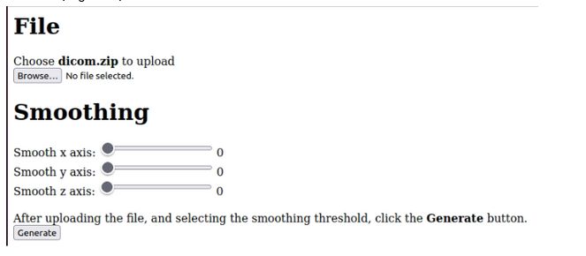
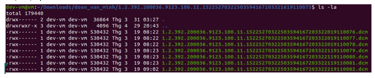
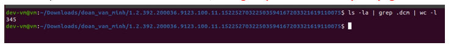
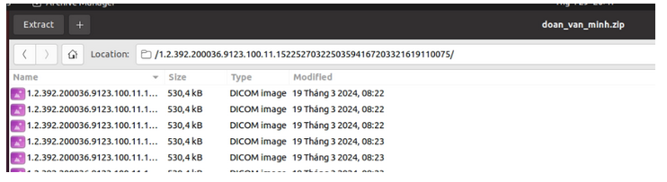
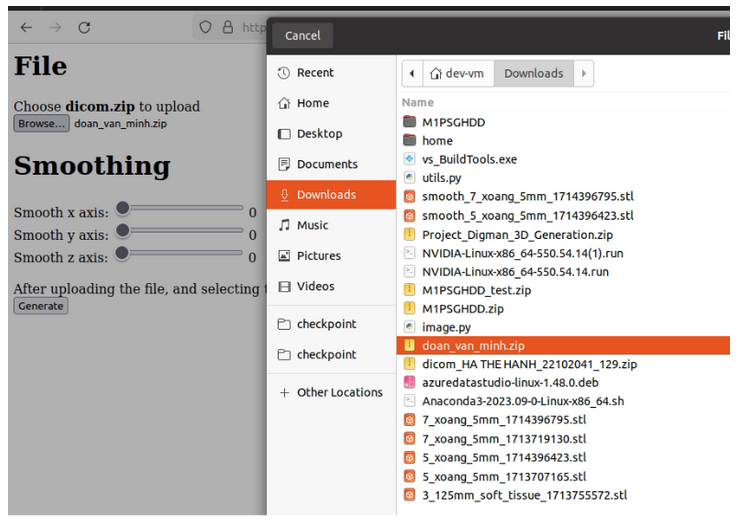
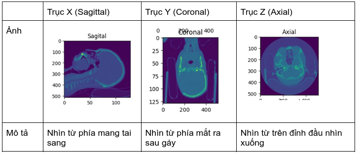
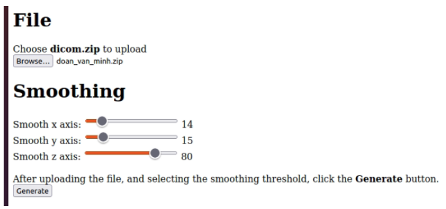
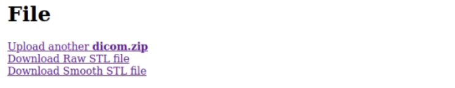
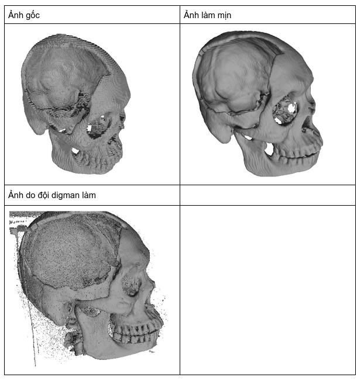

# Dicom-3D-Generation

## Installation
[Not available]

## How to use?
1. Truy cập api theo đường link:
- Đối với mạng public: https://f62b-171-241-69-96.ngrok-free.app/v1/modelapi/
- Đối với mạng local: http://192.168.0.107:8081/v1/modelapi/
-> Xuất hiện giao diện như bên dưới:

2. Chuẩn bị file zip chứa các file chụp cắt lớp dicom (hiện tại chỉ hỗ trợ dạng zip, ko hỗ trợ rar, tar, ..)

-> Toàn bộ file là file dicom với đuôi là .dcm, không được chứa file có định dạng khác.

-> Ví dụ có tổng 345 file dicom

Tiến hành zip folder lại thành file zip:

3. Click: Browse -> upload file zip dicom

4. Phần smoothing, chọn các tham số cần làm mịn:
- Hiện tại hỗ trợ làm mịn mô hình với giá trị làm mịn từ 0 -> 100, giá trị càng cao thì mô hình càng mịn, tuy nhiên việc làm mịn có thể gây mất đi sự chi tiết của mô hình.
- Hỗ trợ làm mịn theo các trục x, y, z

- Việc segment phần xương sẽ có thể gây ra hiện tượng thiếu một số lớp, do một số lớp cắt sẽ ko có phần xương -> cần có cơ chế làm mịn mô hình, ưu tiên làm mịn theo trục nào có chứa ít lớp cắt nhất.

Ví dụ ta chọn làm mịn theo trục z nhiều nhất, làm mịn theo trục x, y ít hơn:

-> Click Generate để tạo mô hình 3D

5. Download STL
- Chờ đợi quá trình xử lý, thường mất từ 3 - 5 phút, tùy thuộc vào số lượng ảnh dicom, số lớp cắt, …
- API trả về response cho phép download file (file gốc do AI trả ra, và file sau khi đã làm mịn)

6. Visualize và in

